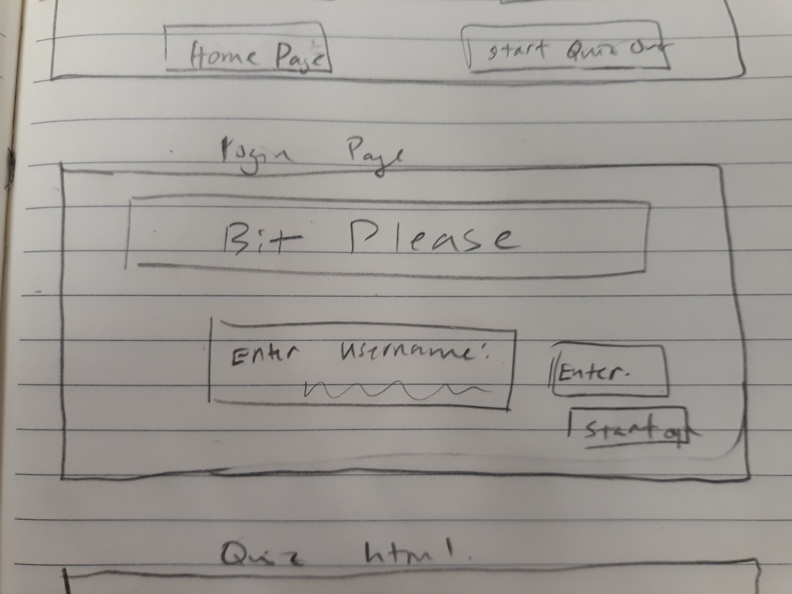
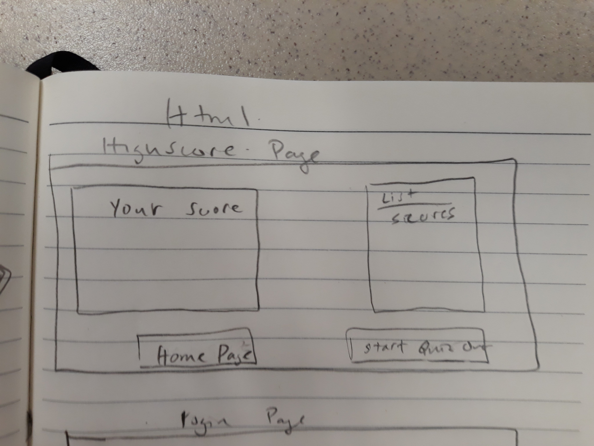

# Bits Please

# Link
[github repo](https://github.com/b-bryant18/bits-please.git)

## Description
A Quiz application that challenges your Javascript knowledge and keeps track of your score.
Icebox features: multiplayer, different types of quizes (HTML/CSS/JSCRIPT)

## User Story
* As a person who wants to learn code, I want to pactice my Javascript, so that I can improve my skills.  
* As a person who enjoys games, I want to improve my skills in an enjoyable manner, so that I can stay motivated.
* As a person who is competetive, I want to show of Javascript knowledge, so that I can compete with my friends. 

## Wire frames
Welcome Page  
  
Question Page  
  
High Scores  
  

## APIs to be used:
#### Server Side APIs
    1. High Scores
    2. User Score
    3. Question Bank

#### Third Party APIs
    1. Qriusity API
    2. Cat API

## Task breakdown

Brad  
    1. Routes  
    2. Server  

Kimi  
    1. Front end/CSS Framework    
    3. Cat API  

Mags  
    1. Questions  
    2. Tests  

Z  
    1. APIs  
    2. Documentation  

# Pseudocode

Viewable:

* Welcome Page
    - Banner (Bits Please!)
    - Input username
        * Required
    - Start

* Game Page
    - Start with explanation/rules

    Javascript Questions
        - API to build Questions
        - Display Questions
        - Answer box
    
    Answer 
        - Encrypt answers!
        - Multiple choice answers
        - Tally Score
        - Display right or wrong
        ↓
        Next Question

* End Screen
    - Final Score
    - High Scores
    - Play Again

Routes
    - API Routes
    - HTML Routes
        * Welcome Page
        * Quiz Page
        * Final Score